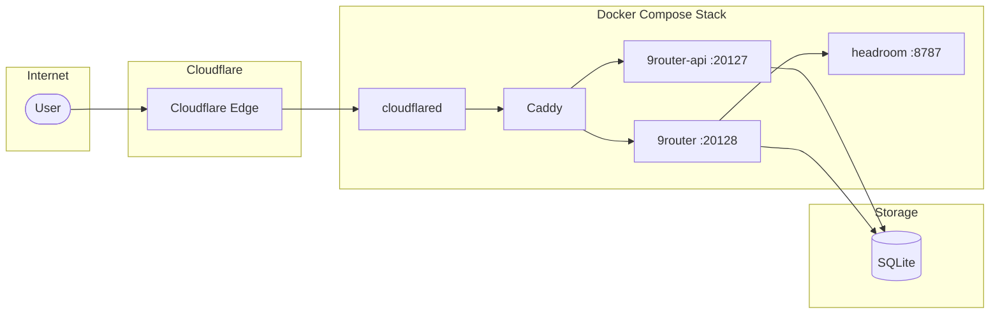

# 9router-deploy

Deployment stack for [9router](https://github.com/lobehub/lobe-chat), an LLM gateway and chat interface. This repository provides Docker Compose configuration for self-hosting 9router with Cloudflare Tunnel ingress.

## Architecture



**Traffic flow:** User → Cloudflare Edge → `cloudflared` (tunnel) → `caddy` (reverse proxy) → `9router-api` / `9router`

## Prerequisites

- Docker & Docker Compose v2+
- Cloudflare account with Zero Trust (free tier works)
- A domain managed by Cloudflare

## Quick Start

```bash
# 1. Clone the repository
git clone https://github.com/vianhanif/9router-deploy.git
cd 9router-deploy

# 2. Copy environment templates
mkdir -p env
cp env/9router.env.example env/9router.env
cp env/9router-api.env.example env/9router-api.env

# 3. Configure your JWT secret (must match in both files)
# Edit env/9router.env and env/9router-api.env

# 4. Create data directories
mkdir -p data/9router data-home/9router-home

# 5. Start services locally (without tunnel)
docker compose -f docker-compose.yml -f docker-compose.local.yml up -d
```

Access locally:
- API: `http://localhost:20127/api/health`
- Dashboard: `http://localhost:20128` (if using `--profile dashboard`)

## Environment Variables

### 9router.env

| Variable | Description | Example |
|----------|-------------|--------|
| `BASE_URL` | Public URL of the dashboard | `https://your-domain.com` |
| `CLOUD_URL` | Cloud/sync URL (usually same as BASE_URL) | `https://your-domain.com` |
| `JWT_SECRET` | Secret for JWT signing (must match 9router-api) | `<random-string>` |
| `DATA_DIR` | Data directory path inside container | `/app/data` |
| `PORT` | HTTP port | `20128` |
| `NODE_ENV` | Environment mode | `production` |

### 9router-api.env

| Variable | Description | Example |
|----------|-------------|--------|
| `PORT` | HTTP port | `20127` |
| `NODE_ENV` | Environment mode | `production` |
| `NINEROUTER_HOME` | Path to 9router source | `/app/9router` |
| `DATA_DIR` | Data directory path inside container | `/app/data` |
| `BASE_URL` | Public URL | `https://your-domain.com` |
| `CLOUD_URL` | Cloud/sync URL | `https://your-domain.com` |
| `JWT_SECRET` | Secret for JWT signing (must match 9router) | `<random-string>` |

### caddy.env

| Variable | Description | Example |
|----------|-------------|--------|
| `SITE_DASHBOARD` | Hostname for dashboard | `dashboard.example.com` |
| `SITE_API` | Hostname for API | `api.example.com` |

### cloudflared.env

| Variable | Description |
|----------|-------------|
| `TUNNEL_TOKEN` | Cloudflare Tunnel token from Zero Trust dashboard |

## Deployment

### Production (with Cloudflare Tunnel)

1. Create a Cloudflare Tunnel in Zero Trust dashboard
2. Configure public hostnames pointing to `caddy:80`
3. Copy the tunnel token to `env/cloudflared.env`
4. Deploy:

```bash
docker compose build 9router 9router-api
docker compose up -d
docker compose ps
```

### GitHub Actions

The included workflow (`.github/workflows/deploy.yml`) deploys on push to `master`.

**Required repository secrets:**

| Secret | Description |
|--------|-------------|
| `TENCENT_HOST` | Deployment server hostname/IP |
| `TENCENT_USER` | SSH username |
| `TENCENT_SSH_KEY` | SSH private key for deployment |

The workflow:
1. Syncs config files to the server
2. Builds new Docker images
3. Runs smoke tests on `/api/health`
4. Switches to new images if tests pass
5. Cleans up old images

## Services

| Service | Port | Description |
|---------|------|-------------|
| `9router` | 20128 | Next.js dashboard UI (profile-gated, optional) |
| `9router-api` | 20127 | Express LLM proxy API |
| `headroom` | 8787 | Token compression/shaping proxy |
| `caddy` | 80 | Reverse proxy with automatic HTTPS |
| `cloudflared` | — | Cloudflare Tunnel connector |

**Data sharing:** Both `9router` and `9router-api` share SQLite storage via bind mount (`./data/9router:/app/data`).

## Repository Structure

```
├── docker-compose.yml          # Production stack
├── docker-compose.local.yml    # Local dev overrides
├── .env.example                # Environment template
├── env/                        # Per-service env files (gitignored)
│   ├── 9router.env.example
│   └── 9router-api.env.example
├── proxy/
│   └── Caddyfile               # Reverse proxy config
├── cloudflared/
│   └── config.yml.example      # Tunnel config template
├── src/
│   ├── 9router/                # Dashboard source
│   └── 9router-api/            # API source
└── .github/workflows/
    └── deploy.yml              # CI/CD workflow
```

## License

MIT
