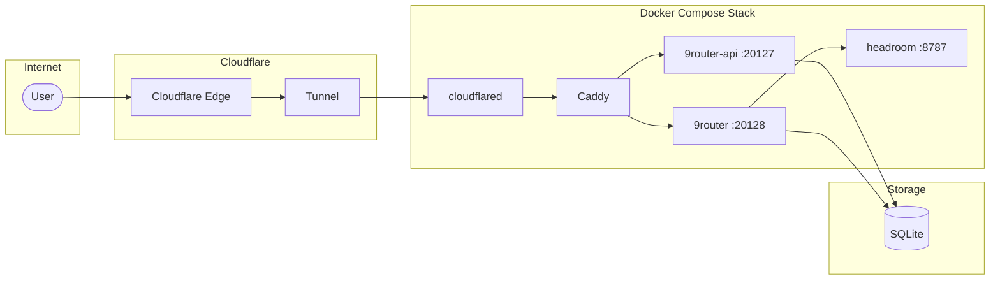

# 9router-deploy

Deployment stack for [9router](https://github.com/lobehub/lobe-chat), an LLM gateway and chat interface. This repository provides Docker Compose configuration for self-hosting 9router with Cloudflare Tunnel ingress and automated CI/CD deploys to a Tencent Cloud VPS.

## Architecture



**Traffic flow:** User → Cloudflare Edge → Cloudflare Tunnel → `cloudflared` → `caddy` (reverse proxy) → `9router-api` / `9router`.

TLS is terminated at the Cloudflare edge; Caddy inside the stack receives plain HTTP from the tunnel and routes by hostname.

## Infrastructure

### Deployment host layout

The stack deploys to `/opt/9router` on the VPS:

```
/opt/9router
├── docker-compose.yml          # Production stack
├── proxy/Caddyfile             # Reverse proxy config
├── src/9router/Dockerfile      # Dashboard image build
├── src/9router-api/Dockerfile  # API image build
├── env/                        # Per-service env files (never committed)
├── cloudflared/                # Tunnel credentials JSON + config
└── data/                       # Shared SQLite data + home volumes
```

### Services

| Service | Port | Description |
|---------|------|-------------|
| `9router` | 20128 | Next.js dashboard UI (profile-gated, optional) |
| `9router-api` | 20127 | Express LLM proxy API |
| `headroom` | 8787 | Token compression/shaping proxy |
| `caddy` | 80 | Reverse proxy (plain HTTP, TLS at Cloudflare edge) |
| `cloudflared` | — | Cloudflare Tunnel connector |

All services share the `9router-net` bridge network. The VPS exposes no public app ports — ingress is exclusively via the Cloudflare Tunnel.

### Routing (Caddy)

`cloudflared` forwards tunneled requests to `caddy:80`; Caddy routes by hostname:

- `dashboard.example.com` → `9router:20128`
- `api.example.com` → `9router-api:20127`

### Data persistence

`9router` and `9router-api` share storage via bind mounts:

- `./data/9router:/app/data` — shared SQLite database
- `./data-home/9router-home:/app/data-home` — shared home volume

## Setup

### Prerequisites

- Docker & Docker Compose v2+
- Cloudflare account with Zero Trust (free tier works)
- A domain managed by Cloudflare
- (For CI/CD) A VPS reachable over SSH, e.g. Tencent Cloud

### 1. Clone and prepare env files

```bash
git clone https://github.com/your-org/9router-deploy.git
cd 9router-deploy

mkdir -p env data/9router data-home/9router-home
cp env/9router.env.example env/9router.env
cp env/9router-api.env.example env/9router-api.env
# Create env/caddy.env and env/cloudflared.env manually (see below)
```

Set `JWT_SECRET` to the same value in both `env/9router.env` and `env/9router-api.env`.

### 2. Run locally (no tunnel)

```bash
docker compose -f docker-compose.yml -f docker-compose.local.yml --profile dashboard up -d
```

Access locally:
- API: `http://localhost:20127/api/health`
- Dashboard: `http://localhost:20128`

The local override keeps `caddy` and `cloudflared` stopped; only `9router`, `9router-api`, and `headroom` run.

### 3. Cloudflare Tunnel and DNS guide

1. In the Cloudflare dashboard, go to **Zero Trust → Networks → Tunnels** and **Create a tunnel**. Pick the **Cloudflared** connector type.
2. Name the tunnel (e.g. `9router-prod`) and copy its token into `env/cloudflared.env`:

```bash
TUNNEL_TOKEN=<paste-cloudflare-tunnel-token-here>
```

3. Configure public hostnames pointing to the Caddy service:

| Public hostname | Service |
|-----------------|---------|
| `dashboard.example.com` | `http://caddy:80` |
| `api.example.com` | `http://caddy:80` |

4. Match the hostnames in `env/caddy.env`:

```bash
SITE_DASHBOARD=dashboard.example.com
SITE_API=api.example.com
```

5. Cloudflare creates the DNS CNAME records automatically (`<tunnel-id>.cfargotunnel.com`). To add them manually:

```bash
dashboard.example.com  CNAME  <tunnel-id>.cfargotunnel.com
api.example.com        CNAME  <tunnel-id>.cfargotunnel.com
```

6. Verify the tunnel status is **Healthy** in the Zero Trust dashboard, then deploy.

> Never commit tunnel credentials — `env/*.env` and `cloudflared/*.json` are gitignored, and the credentials JSON should be mode `600` on the server.

## Deployment

### Manual (production, with tunnel)

```bash
docker compose build 9router 9router-api
docker compose up -d
docker compose ps
```

### CI/CD with GitHub Actions

The workflow `.github/workflows/deploy.yml` deploys on:
- push to `master`
- manual `workflow_dispatch` (with optional `ninerouter_branch` / `api_branch` inputs)
- `repository_dispatch` of type `deploy`

**Required repository secrets** (GitHub → Settings → Secrets and variables → Actions):

| Secret | Description |
|--------|-------------|
| `TENCENT_HOST` | Deployment server hostname/IP |
| `TENCENT_USER` | SSH username |
| `TENCENT_SSH_KEY` | SSH private key for deployment |

**Pipeline steps:**

1. **Sync config** — copies `docker-compose.yml`, `proxy/Caddyfile`, and both Dockerfiles to `/opt/9router` via SCP.
2. **Build new images** — resolves source SHAs and builds `9router` and `9router-api`; previous images are tagged `:prev` for rollback.
3. **Smoke test** — runs each new image on scratch ports (`20328`/`20327`) and verifies `/api/health` plus the `/v1/responses` route. The deploy aborts if either check fails.
4. **Switch** — recreates the stack with the new images (`--force-recreate`), then stops the profile-gated dashboard.
5. **Prune** — removes `:prev` rollback images, dangling images, and build cache (only after a successful deploy).

### Preview deployments (non-master branches)

`.github/workflows/preview.yml` spins up an **isolated** stack so a branch can be tested on its own hostnames without touching production.

| | Production | Preview |
|---|---|---|
| Compose project | `9router` | `9router-preview` |
| Compose file | `docker-compose.yml` | `docker-compose.preview.yml` |
| Caddyfile | `proxy/Caddyfile` | `proxy/Caddyfile.preview` |
| Containers | `9router`, `9router-api`, `headroom`, `caddy` | `9router-test`, `9router-api-test`, `headroom-test`, `caddy-test` |
| Data | `./data/9router` | `./data-preview/9router` |
| Hostnames | `9router.vianhanif.link`, `9router-dashboard.vianhanif.link` | `9router-test.vianhanif.link`, `9router-dashboard-test.vianhanif.link` |

**Triggers:** `workflow_dispatch` or `repository_dispatch` of type `preview`.

**Inputs:**

| Input | Values | Notes |
|---|---|---|
| `branch` | branch name or 40-char SHA | source for **both** 9router and 9router-api builds |
| `type` | `select` \| `dashboard` \| `api` \| `both` | `select` + non-master is a hard failure; `select` + `master` resolves to `both` |
| `action` | `deploy` \| `teardown` | teardown runs `docker compose ... down -v` |

**Data seeding:** on the first deploy, `./data/9router` is copied to `./data-preview/9router` with `rsync`. The preview then owns its copy and never writes back to production data.

**Networking:** `caddy-test` joins the production Docker network (`9router_9router-net`) as an external network so the already-running `cloudflared` can reach it, while the preview containers themselves stay on their own `9router-preview-net`.

**Prerequisite — Cloudflare ingress (manual, one-time):** the tunnel is token-managed, so ingress rules live in the Cloudflare Zero Trust dashboard, not in this repo. Add two public hostnames pointing at the same origin service:

```
9router-test.vianhanif.link            ->  http://caddy-test:80
9router-dashboard-test.vianhanif.link  ->  http://caddy-test:80
```

**No rollback:** a broken preview is torn down, not rolled back. The workflow has no `:prev` snapshot logic.

**Concurrency:** the preview lock (`preview-9router-deploy`) is separate from the production lock (`deploy-9router`), so the two pipelines never block each other.

## Environment Variables

### 9router.env

| Variable | Description | Example |
|----------|-------------|--------|
| `BASE_URL` | Public URL of the dashboard | `https://dashboard.example.com` |
| `CLOUD_URL` | Cloud/sync URL (usually same as BASE_URL) | `https://dashboard.example.com` |
| `JWT_SECRET` | Secret for JWT signing (must match 9router-api) | `<random-string>` |
| `DATA_DIR` | Data directory path inside container | `/app/data` |
| `PORT` | HTTP port | `20128` |
| `NODE_ENV` | Environment mode | `production` |

### 9router-api.env

| Variable | Description | Example |
|----------|-------------|--------|
| `PORT` | HTTP port | `20127` |
| `NODE_ENV` | Environment mode | `production` |
| `NINEROUTER_HOME` | Path to 9router source | `/app/9router` |
| `DATA_DIR` | Data directory path inside container | `/app/data` |
| `BASE_URL` | Public URL | `https://dashboard.example.com` |
| `CLOUD_URL` | Cloud/sync URL | `https://dashboard.example.com` |
| `JWT_SECRET` | Secret for JWT signing (must match 9router) | `<random-string>` |

### caddy.env

| Variable | Description | Example |
|----------|-------------|--------|
| `SITE_DASHBOARD` | Hostname for dashboard | `dashboard.example.com` |
| `SITE_API` | Hostname for API | `api.example.com` |

### cloudflared.env

| Variable | Description |
|----------|-------------|
| `TUNNEL_TOKEN` | Cloudflare Tunnel token from Zero Trust dashboard |

## Repository Structure

```
├── docker-compose.yml          # Production stack
├── docker-compose.local.yml    # Local dev overrides
├── .env.example                # Environment template
├── env/                        # Per-service env files (gitignored)
│   ├── 9router.env.example
│   └── 9router-api.env.example
├── proxy/
│   └── Caddyfile               # Reverse proxy config
├── cloudflared/
│   └── config.yml.example      # Tunnel config template
├── src/
│   ├── 9router/                # Dashboard source
│   └── 9router-api/            # API source
└── .github/workflows/
    └── deploy.yml              # CI/CD workflow
```

## Security

- Never commit real secrets: `.env`, `env/*.env`, and `cloudflared/*.json` are gitignored.
- The CI/CD pipeline reads credentials exclusively from GitHub Actions secrets (`TENCENT_HOST`, `TENCENT_USER`, `TENCENT_SSH_KEY`).
- Keep tunnel credentials mode `600` on the server.
- This repository contains no real secrets; all examples use placeholder values.

## License

MIT
